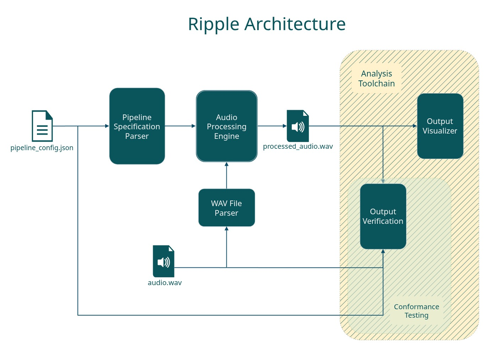

  

<h1 align="center">Ripple</h1>

A minimal audio processing library for WAV files

## Requirements:
- GCC
- C11
- Python3
- nava

## Support
Only PCM WAV files are supported.
Only fixed header WAV files are supported, i.e., no variable length INFO metadata (for now) 
Note: you can use [link](https://makeaudio.app/remove-wav-metadata) to strip additional tags from the wav file

## Usage
### Volume and Gain
Ripple uses two scales the logarithmic (dB) scale and a linear (0-100%) scale, providing conversions between the two scales. It is recommended to use the API functions that work on the linear volume scale, as it is simpler and more intuitive.

## System Architecture

  

### Error Handling Model
All API functions that perform any operation that can fail send back a status code in one of two ways: a function return or passing a status argument. Note that the latter can be ignored by passing NULL.
> [!NOTE]
> Diagnostic/miscellaneous functions do not return error status codes.

### SIMD Optimizations
The supported SIMD instructions sets: AVX2 only
[!NOTE]
> Ripple uses SIMD for vectorizing arithmetic operations only (i.e., no SIMD load or store instructions), thus sample data itself has no alignment requirements.

## Improvements/TODO:
- 